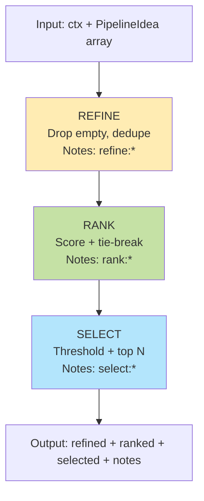
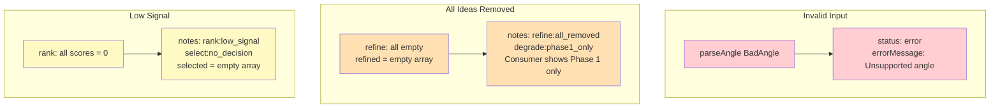

# AngleLab

AngleLab is a compact end-to-end system built around clear separation of concerns, deterministic behavior, and explicit handling of failure cases.

The scope is deliberately small so the architecture stays easy to inspect and discuss.

---

## Phase 1 - Product Core (DONE)

What was built:
- A pure domain model (`Angle`, `Idea`)
- A deterministic idea generator (`generateIdeas`)
- A schema layer for validating raw input
- An orchestrator responsible for control flow and state transitions
- A UI-agnostic ViewState model
- A minimal CLI consumer to prove the flow end-to-end

Why it matters:
- Runnable end-to-end
- Invalid input is handled safely
- Each layer has explicit ownership
- No premature decision logic in the core

---

## Phase 2 - Deterministic Rules Pipeline (DONE)

What was added:
- A rules-only pipeline executed strictly after Phase 1 success:
  - `refineIdeas`
  - `rankIdeas`
  - `selectIdeas`
- Fully deterministic behavior
- A clear input/output contract
- Pipeline-owned explanatory notes
- Explicit degradation policies with no forced answers

Why it exists:

Phase 2 introduces judgment without contaminating the core - quality gates, prioritization, and the ability to explicitly return "no decision".

---

## Phase 3 - Consumers and Narrative (DONE)

Scope:
- A Web consumer (Next.js) reusing the same core
- Minimal, targeted tests
- Architecture documentation
- Demo narrative for interviews

Phase 3 focuses on presentation and explainability, not new logic.

---

## What this project does not do (intentional)

- No AI integration
- No persistence
- No external services in the implemented system
- No UI logic inside core layers
- No feature creep

---

## How to run

Install:
```bash
npm ci
```

CLI:
```bash
npm run cli
```

Tests:
```bash
npm run test
```

Typecheck:
```bash
npm run typecheck
```

Web:
```bash
npm run dev:web    # development
npm run build:web  # production build
npm run start:web  # production server
```

---

## Project Status

- Phase 1: Complete (Product Core)
- Phase 2: Complete (Deterministic Rules Pipeline)
- Phase 3: Complete (Consumers + Docs)

This repository is intentionally scoped and considered interview-ready. Future work would be additive and introduced behind new boundaries, without changing the core.

---

## Architecture

The project uses a layered architecture where each layer has a clear responsibility.

### System Overview
```mermaid
graph TB
    A[CONSUMERS<br/>CLI + Web<br/>Rendering only]
    B[VIEW STATE<br/>idle | loading | success | error]
    C[ORCHESTRATOR<br/>Control Flow<br/>Validate → Execute → Produce ViewState]
    D[SCHEMA<br/>parseAngle<br/>Validation]
    E[DOMAIN<br/>generateIdeas<br/>Pure Logic]
    F[PHASE 2 PIPELINE<br/>refine → rank → select<br/>Produces notes]
    
    A -->|Render state| B
    B -->|State transitions| C
    C -->|Validate input| D
    C -->|Generate ideas| E
    E -->|Apply rules| F
    
    style A fill:#E3F2FD
    style B fill:#E8F5E9
    style C fill:#FFF9C4
    style D fill:#FFE0B2
    style E fill:#E1BEE7
    style F fill:#FCE4EC
```

<details>
<summary>Text version</summary>
```
┌─────────────────────────────────────────┐
│       CONSUMERS (CLI + Web)             │
│     Rendering only - NO logic           │
└───────────────────┬─────────────────────┘
                    │ Render state
                    ▼
┌─────────────────────────────────────────┐
│         VIEW STATE (UI-agnostic)        │
│   idle | loading | success | error      │
└───────────────────┬─────────────────────┘
                    │ State transitions
                    ▼
┌─────────────────────────────────────────┐
│      ORCHESTRATOR (Control Flow)        │
│  • Validate input (Schema)              │
│  • Execute async workflow               │
│  • Produce ViewState                    │
└───────┬─────────────────────┬───────────┘
        │                     │
        ▼                     ▼
┌──────────────┐    ┌────────────────────┐
│   SCHEMA     │    │   DOMAIN (Pure)    │
│  parseAngle  │    │  generateIdeas     │
│ (Validation) │    │  (Deterministic)   │
└──────────────┘    └─────────┬──────────┘
                              │ Apply rules
                              ▼
                    ┌────────────────────┐
                    │ PHASE 2 PIPELINE   │
                    │ refine→rank→select │
                    │ (Produces notes)   │
                    └────────────────────┘
```

</details>

The orchestrator handles control flow and validation. Pure business logic lives in the domain layer. The view state layer keeps UI concerns separate from the core logic.

### Phase 2 Pipeline

After generating initial ideas, they go through a three-stage pipeline:


<details>
<summary>Text version</summary>
```
Input: ctx + PipelineIdea[]
         │
         ▼
    ┌──────────┐
    │  REFINE  │ → Drop empty, dedupe
    └────┬─────┘   Notes: refine:*
         │
         ▼
    ┌──────────┐
    │   RANK   │ → Score + tie-break
    └────┬─────┘   Notes: rank:*
         │
         ▼
    ┌──────────┐
    │  SELECT  │ → Threshold + top N
    └────┬─────┘   Notes: select:*
         │
         ▼
Output: refined + ranked + selected + notes[]
```

</details>

Each stage is deterministic and produces diagnostic notes (like `refine:dedup:2` or `rank:tie`) so you can trace what happened.

### How It Handles Failures

Instead of crashing, the system degrades gracefully:


<details>
<summary>Text version</summary>
```
INVALID INPUT                ALL IDEAS REMOVED              LOW SIGNAL
┌─────────────┐             ┌─────────────────┐           ┌──────────────┐
│ parseAngle  │             │ refine: all     │           │ rank: all    │
│ "BadAngle"  │             │ ideas empty     │           │ scores = 0   │
└──────┬──────┘             └────────┬────────┘           └──────┬───────┘
       │                             │                           │
       ▼                             ▼                           ▼
┌─────────────┐             ┌─────────────────┐           ┌──────────────┐
│ status:     │             │ notes:          │           │ notes:       │
│ 'error'     │             │ 'all_removed'   │           │ 'low_signal' │
│             │             │ 'phase1_only'   │           │ 'no_decision'│
│ errorMsg    │             │                 │           │              │
└─────────────┘             │ → Show Phase 1  │           │ selected=[]  │
                            └─────────────────┘           └──────────────┘
```

</details>

When confidence is low or something goes wrong, you get empty results with notes explaining why. No forced answers.

---

## Testing

Run the test suite:
```bash
npm run test
```

Tests cover schema validation, pipeline determinism, and edge case handling. The focus is on contracts and failure modes rather than implementation details.

This keeps the test suite small and maintainable while proving the architecture works as designed.

---